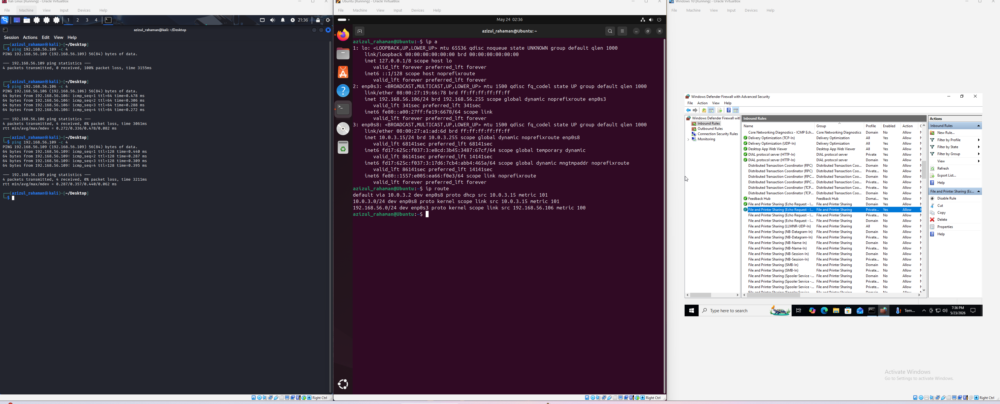

# SOC Analyst Home Lab - Project 1

## Objective
Build a functional cybersecurity home lab using virtual machines to simulate 
a real SOC environment for threat detection and security monitoring practice.

## Lab Architecture

| VM | OS | IP Address | Role |
|---|---|---|---|
| Kali Linux | Debian 64-bit | 192.168.56.101 | Analyst / Attack Machine |
| Ubuntu Server | Ubuntu 64-bit | 192.168.56.106 | Log Server / SIEM Host |
| Windows 10 | Windows 64-bit | 192.168.56.109 | Target / Monitored Machine |

## Network Configuration
- **Network Type:** Host-Only Adapter (VirtualBox)
- **Subnet:** 192.168.56.0/24
- **All VMs communicate with each other successfully**

## Tools Used
- VirtualBox (Hypervisor)
- Kali Linux
- Ubuntu Server 24.04 LTS
- Windows 10 Enterprise

## Proof of Connectivity
All three machines successfully ping each other with 0% packet loss.

## What I Learned
- Configuring virtual networks in VirtualBox
- Host-Only networking between multiple VMs
- Windows Firewall ICMP rule configuration
- Linux networking commands (ip a, ip route, ping)
- Documenting a technical lab environment

## Project 2: Network Vulnerability Scanning with Nmap

### Objective
Perform network reconnaissance and vulnerability scanning across all lab machines.

### Scans Performed

| Target | IP | Open Ports | Key Findings |
|---|---|---|---|
| Windows 10 | 192.168.56.109 | 135, 139, 445 | SMB signing not required |
| Ubuntu Server | 192.168.56.106 | 22 | OpenSSH 9.6p1 |

### Security Findings
- **Port 445 (SMB)** on Windows 10 has signing not required — vulnerable to relay attacks
- **Port 22 (SSH)** on Ubuntu running modern OpenSSH 9.6p1 — low risk

### Tools Used
- Nmap 7.95
- Kali Linux

### Evidence
- [Windows Scan Results](windows_scan.txt)
- [Ubuntu Scan Results](ubuntu_scan.txt)

## Project 3: Network Traffic Analysis with Wireshark

### Objective
Capture and analyze real network traffic to identify normal behavior 
and detect port scanning activity.

### What I Did
- Captured live network traffic on eth0 interface
- Filtered ICMP traffic to analyze ping requests and replies
- Ran an Nmap port scan and captured it in Wireshark
- Identified what a port scan looks like in packet captures

### Key Findings

| Traffic Type | What I Saw | SOC Significance |
|---|---|---|
| ICMP | Ping requests/replies between Kali and Windows | Normal traffic |
| ARP | Machines discovering each other | Normal traffic |
| TCP SYN flood | Thousands of SYN packets to different ports | Port scan detected |

### What a Port Scan Looks Like
One machine sending SYN packets to thousands of ports in seconds is a 
red flag in any SOC environment. This would trigger an IDS/IPS alert 
in a real network.

### Tools Used
- Wireshark 4.4.7
- Kali Linux
- Nmap 7.95

### Evidence
- [Packet Capture File](lab_capture.pcapng)
